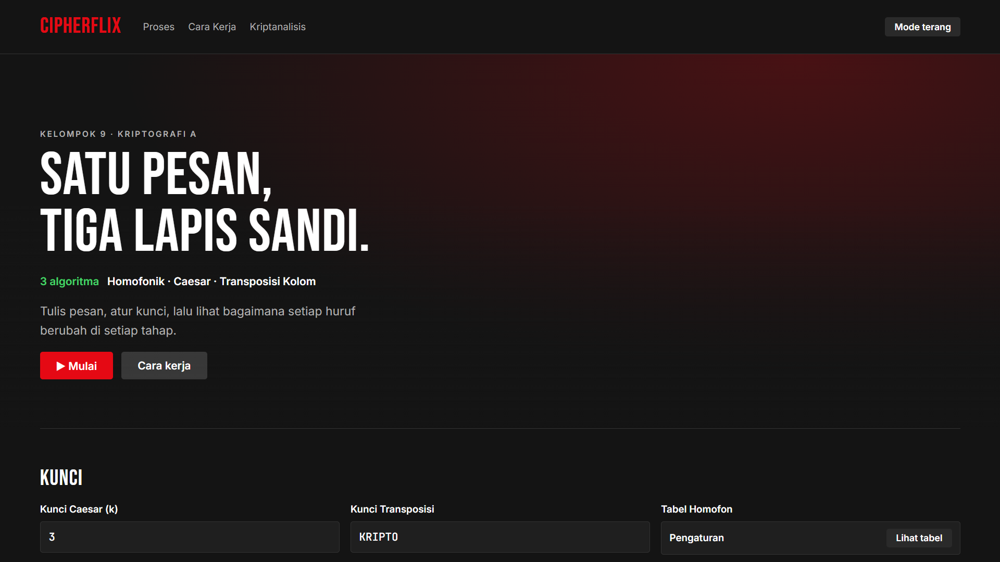
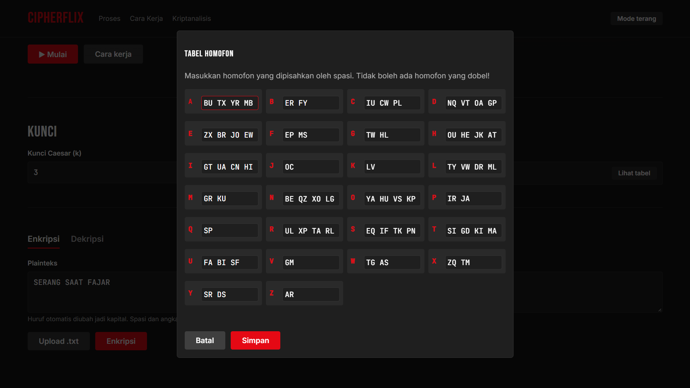
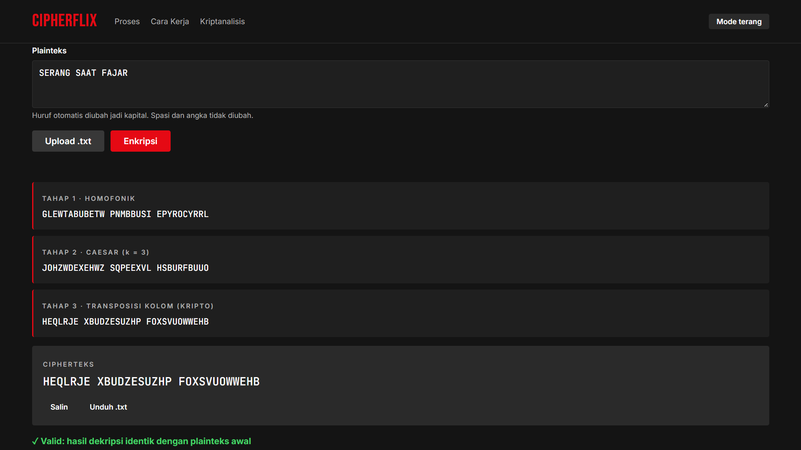
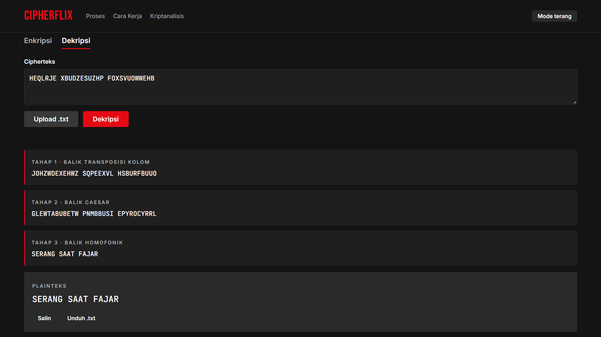
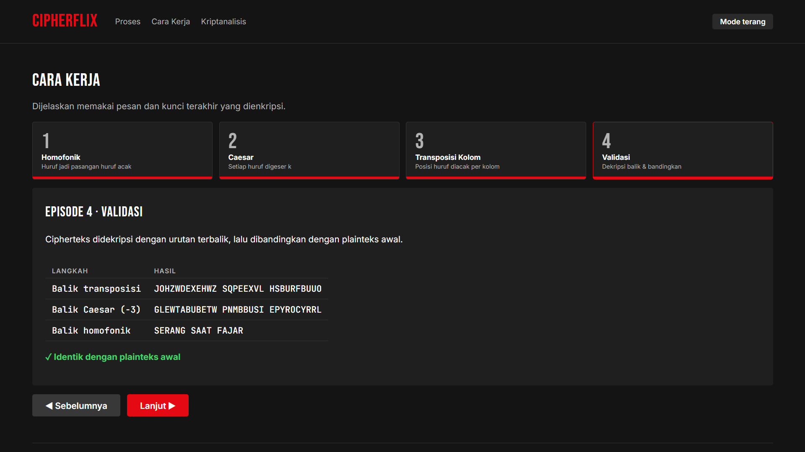
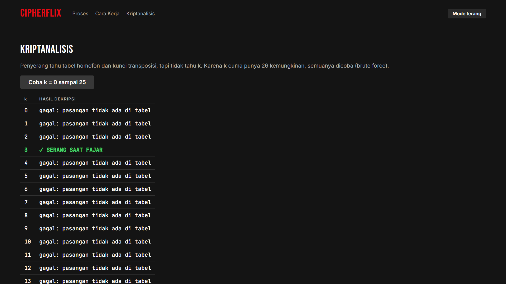

# CipherFlix · Kriptografi Kelompok 9

Program enkripsi berlapis untuk Tugas Proyek Kriptografi (IF21A05), Informatika Unsoed.

**Alur:** Plainteks → Homofonik → Caesar → Transposisi Kolom → Cipherteks
(dekripsi dengan urutan terbalik)

## Cara menjalankan
Buka `index.html` di browser. Tidak perlu install apa pun.

## Fitur
- Input plainteks/cipherteks lewat teks atau file `.txt`
- Input kunci: angka Caesar, kata kunci transposisi dan tabel homofon custom
- Enkripsi & dekripsi, hasil tiap tahap ditampilkan
- Validasi: hasil dekripsi dibandingkan dengan plainteks awal
- Cara Kerja: penjelasan per tahap ala episode
- Kriptanalisis: brute force kunci Caesar
- Unduh hasil ke file `.txt`, mode gelap/terang

## Struktur file
| File | Isi |
|---|---|
| `js/homofonik.js` | Tabel homofon + enkripsi/dekripsi homofonik |
| `js/caesar.js` | Caesar cipher |
| `js/transposisi.js` | Transposisi kolom |
| `js/app.js` | Penghubung tampilan dan algoritma |
| `test/test.js` | Tes otomatis (`node test/test.js`) |

Catatan: tabel homofon di slide punya 4 pasangan dobel (TF, JO, MS, FI) yang membuat dekripsi ambigu, jadi sudah diganti (N: QZ, L: VW, T: XK, X: ZQ).

Tanpa library kriptografi; semua algoritma ditulis manual.

## Dokumentasi

  <table>
    <tr>
      <td align="center">
         
        <b>Home</b>
      </td>
      <td align="center">
         
        <b>Tabel Homofon</b>
      </td>
    </tr>
    <tr>
      <td align="center">
         
        <b>Enkripsi</b>
      </td>
      <td align="center">
         
        <b>Dekripsi</b>
      </td>
    </tr>
    <tr>
      <td align="center">
         
        <b>Cara Kerja</b>
      </td>
      <td align="center">
         
        <b>Kriptanalisis</b>
      </td>
    </tr>
  </table>

## Anggota
Rahmadani Hafsari (H1D024057) · Biladi Amna (H1D024074) · Ahmad Fikri Zakaria (H1D024062) · Latifanika Nurafwi (H1D024099)· Muhammad Fathan Ramdani (H1D024026)
